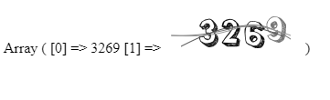

# EasySVG for PHP
>本扩展部分代码来源于网络，笔者这也是东拼西凑，希望能帮助到您的需求。

&emsp;&emsp;“EasySVG”可以将“文字信息(中文、字母、数字)”输出为SVG格式的矢量图，目前笔者开发这个扩展主要用于网络安全效验方面。目前“font”文件夹下的所有字库只支持“数字”，不过也可以继续完善你想要的功能，详情见本文档使用说明。
## 一、基础使用

```php
require_once( '../src/EasySVG.php' );
    try {
        $obj    = ( new EasySVG() );
        $result = $obj->CreateCaptcha();
        print_r( $result );
    } catch( Exception $e ) {
        print_r( $e->getMessage() );
    }
```
### 示例效果



```text
Array
(
[0] => 3269
[1] =>
<?xml version="1.0"?>
<svg version="1.1" xmlns="http://www.w3.org/2000/svg" width="150px" height="50px">
	<path fill="#222"
		d="M48.828125,12.567703908645q1.875,0,4.19921875,1.97265625l3.046875,3.4765625q2.28515625,3.4765625,2.28515625,5.3125q-1.171875,3.4765625-2.65625,4.08203125q-0.390625,0-0.64453125,0.5078125q0.703125,0.52734375,2.9296875,3.45703125q0.3125,0.234375,1.015625,3.59375q-0.33203125,3.3203125-2.16796875,5.3125q-0.9375,1.03515625-3.30078125,2.71484375l0-0.1171875q-1.73828125,0.60546875-3.9453125,0.99609375l-0.8984375,0q-2.08984375-0.1171875-6.23046875-3.45703125q-1.38671875-0.78125-2.5390625-2.109375q-0.8984375,0-2.421875-4.9609375q0.13671875-1.484375,1.5234375-1.484375l0.13671875-0.1171875l3.9453125,0.25390625l0.1171875,0.1171875q0.46875,0,0.8984375,1.6015625q2.421875,1.11328125,3.18359375,1.11328125q1.97265625-1.015625,2.5390625-2.59765625l-0.13671875-0.1171875l-0.625,0.1171875q-0.29296875,0-2.79296875-2.83203125l-0.13671875,0l-0.390625,0.1171875q-1.1328125-0.37109375-1.1328125-4.94140625l0.1171875-0.13671875l-0.37109375-0.234375l-0.64453125,0.1171875l-0.76171875-0.1171875q-0.48828125,0.234375-1.40625,0.234375q-1.38671875-2.08984375-3.1640625-3.0859375l-0.25390625-0.37109375l0.25390625-0.7421875l0-0.99609375l2.28515625-3.45703125q3.5546875-3.10546875,7.3828125-3.10546875z M39.4140625,20.497391408645l-0.390625-0.25390625l0,0.37109375l0.64453125,0l0.37109375,0.25390625l0.64453125,0l0.76171875-0.13671875l0.64453125,0.13671875q0.33203125-0.0390625,1.640625-1.875q1.71875-1.42578125,2.03125-1.484375q3.57421875,0.21484375,3.57421875,1.73828125l0.5078125,1.3671875q0,2.44140625-4.08203125,4.19921875l-0.1171875,0.5078125l0.1171875,2.34375l1.796875,0l0.1171875,0.1171875l0.13671875-0.1171875q3.30078125,0,3.30078125,3.45703125q-0.80078125,3.96484375-1.40625,3.96484375q-0.7421875,1.11328125-2.40234375,1.11328125l-0.25390625,0q-3.4375-0.78125-3.4375-1.85546875q-0.3125,0-0.76171875-1.484375l-0.13671875,0.1171875l-0.1171875,0l-0.5078125-0.1171875l-0.13671875,0.1171875l-0.1171875,0l-2.9296875-0.234375l-0.390625,0.1171875l0,0.37109375q1.09375,4.58984375,2.5390625,4.58984375q1.4453125,1.30859375,3.57421875,1.71875l0.625-0.1171875l2.3046875,0q0.25390625,0,0.25390625-0.37109375l0.5078125,0l0.25390625,0.25390625q1.484375-0.37109375,3.80859375-1.62109375q1.2109375,0,2.55859375-4.70703125l0.25390625-1.6015625q-0.859375-3.59375-1.66015625-3.59375q-0.01953125-0.390625-2.16796875-2.2265625l-0.25390625-1.34765625l0.13671875-0.13671875l0.1171875,0q0.25390625,0,0.390625,0.7421875q2.5390625-1.38671875,2.5390625-4.19921875q0-3.18359375-3.5546875-6.6796875l-1.796875-0.5078125q-1.953125,0-5.83984375,1.62109375q-0.29296875,0.44921875-1.66015625,1.23046875q-1.015625,1.8359375-1.9140625,4.21875l-0.1171875,0z M45.25390625,19.130203908645l0,0.234375q0.64453125,0.09765625,0.64453125,0.625l0.25390625,0l0-0.1171875q-0.5078125-0.625-0.5078125-0.99609375l-0.13671875,0z M44.74609375,19.364578908645q0,0.37109375-0.5078125,0.37109375l0,0.25390625l0.25390625,0.5078125l0.25390625,0q0-0.76171875,0.25390625-0.76171875q0.5078125,0.56640625,0.5078125,0.87890625l0.25390625,0q-0.29296875-0.8203125-1.015625-1.25z M56.2109375,20.497391408645q0.15625,0.7421875,0.37109375,0.7421875l0-0.37109375z M43.984375,20.731766408645l0,0.13671875l0.390625,0.60546875l0.1171875,0l0-0.1171875l-0.37109375-0.625l-0.13671875,0z M56.58203125,21.356766408645l0,0.1171875l0.5078125,1.3671875l0,0.1171875l0.25390625,0l0-0.60546875q0-0.68359375-0.625-0.99609375l-0.13671875,0z M55.56640625,21.473953908645q0,0.6640625-0.37109375,0.99609375q0.29296875,0.7421875,0.5078125,0.7421875l0-0.1171875l-0.13671875-0.7421875l0.13671875-0.13671875l0.1171875,0l0.25390625,0.5078125l0.13671875,0l0-0.13671875l-0.390625-1.11328125l-0.25390625,0z M40.17578125,21.727860158645l0,0.1171875l1.1328125,0.99609375l0-0.1171875q-0.625-0.6640625-0.625-0.99609375l-0.5078125,0z M41.8359375,21.845047658645l0,0.13671875q0,1.015625,1.38671875,1.23046875l0.64453125,0.37109375l0.625,0l0-0.1171875q-0.2734375-0.625-2.03125-0.87890625q0-0.7421875-0.625-0.7421875z M45.5078125,23.583328908645l0,0.1171875l0.13671875,0.13671875l0,0.1171875l0.8984375-0.7421875q0.33203125,0,0.625-0.7421875q0.64453125,0,0.64453125-0.37109375l0-0.25390625q-2.3046875,0.60546875-2.3046875,1.73828125z M54.55078125,23.466141408645l-0.13671875,0.37109375l0.8984375,0.859375l0-0.1171875l-0.5078125-1.11328125l-0.25390625,0z M55.1953125,23.583328908645l0,0.25390625l0.25390625,0.234375l0-0.234375z M53.90625,24.325516408645l0,0.1171875q0,0.703125,1.03515625,1.62109375l0-0.13671875q-0.7421875-1.6015625-1.03515625-1.6015625z M53.28125,24.696610158645l0,0.37109375l0.37109375,0.37109375l0-0.37109375z M55.3125,25.438797658645l0,0.25390625l0.5078125,0.7421875l0.13671875,0l0-0.25390625z M54.55078125,27.177078908645l0.13671875,0.1171875l0.37109375-0.1171875l0-0.25390625l-0.25390625,0z M47.8125,29.520828908645l0,0.1171875q0.33203125,0,1.015625,0.625l0-0.1171875l-0.64453125-0.7421875z M56.07421875,31.122391408645l0,0.625l0.5078125,0.48828125l0-0.37109375q0-0.625-0.37109375-0.7421875l-0.13671875,0z M57.48046875,32.977860158645l0,0.25390625l0.1171875,0.37109375l0.13671875,0l0-0.25390625l-0.13671875-0.37109375l-0.1171875,0z M55.8203125,33.856766408645l0,0.48828125l0.13671875,0l0-0.48828125l-0.13671875,0z M47.55859375,34.833328908645l0.25390625,0.25390625l0.1171875-0.1171875l0.13671875,0l0,0.1171875q0,0.25390625-0.5078125,0.25390625l0,0.1171875l0.37109375,0l1.40625-0.859375l0-0.25390625q-0.80078125,0.48828125-1.77734375,0.48828125z M56.46484375,34.970047658645l-0.13671875,0.1171875l0,0.48828125l0.76171875,0.99609375l0-0.1171875q0-0.9375-0.625-1.484375z M57.59765625,36.083328908645l0,0.48828125l0.25390625-0.234375l0-0.25390625l-0.25390625,0z M56.2109375,36.200516408645l0,0.13671875l0.625,1.85546875l0.25390625-0.25390625q-0.37109375-1.58203125-0.87890625-1.73828125z M54.8046875,36.708328908645l0,0.234375l0.64453125,1.11328125l-0.13671875,0.13671875l0,0.37109375l0.13671875,0l0.1171875-0.5078125l-0.5078125-1.34765625l-0.25390625,0z M55.703125,37.450516408645l0.625,1.6015625l0.13671875,0l0.25390625-0.625q-0.64453125-0.390625-0.64453125-0.9765625l-0.37109375,0z M54.04296875,37.938797658645q0.76171875,0.3515625,0.76171875,0.859375l0.13671875,0l0-0.1171875q-0.3515625-0.9375-0.64453125-0.99609375z M53.7890625,38.934891408645l0,0.48828125l0.25390625,0l0-0.48828125l-0.25390625,0z M52.890625,39.169266408645l0,0.25390625l0.390625,0.625l0.1171875,0l0-0.37109375q-0.078125-0.37109375-0.5078125-0.5078125z M53.90625,39.540360158645l0,0.13671875l0.25390625,0.234375l0-0.1171875z M54.94140625,39.540360158645l0,0.13671875l0.1171875,0.37109375l0.13671875-0.13671875l0.1171875,0l-0.1171875-0.37109375l-0.25390625,0z M51.62109375,39.911453908645l0,0.13671875q0,0.234375,0.76171875,0.48828125q0.1953125,0.48828125,0.390625,0.48828125l0.1171875,0l0-0.1171875q-0.46875-1.11328125-0.87890625-1.11328125z M54.16015625,40.048172658645l0.390625,0.48828125l0-0.1171875l-0.13671875-0.5078125l-0.1171875,0.13671875l-0.13671875,0z M46.2890625,40.282547658645l0,0.13671875l0.5078125,0l0-0.13671875l-0.5078125,0z M48.828125,40.790360158645l0,0.1171875q0,0.2734375,0.625,0.37109375z M53.53515625,40.790360158645l0,0.234375l0.25390625,0.25390625l0.1171875-0.1171875l0-0.13671875z M47.55859375,41.024735158645l0,0.25390625l0.25390625,0.25390625l0.25390625,0l0-0.25390625l-0.25390625-0.25390625l-0.25390625,0z M48.3203125,41.532547658645l0,0.1171875q0,0.2734375,0.625,0.37109375l-0.5078125-0.48828125l-0.1171875,0z M52.12890625,42.138016408645l0.13671875,0q0.625-0.15625,0.625-0.37109375l-0.25390625,0z M50.859375,41.903641408645l0.25390625,0.234375l0.13671875,0l-0.25390625-0.234375l-0.13671875,0z" />
	<path fill="#111"
		d="M71.54296875,12.655509310456q2.96875,0.46875,4.5703125,1.40625q1.1328125,0.44921875,3.06640625,2.578125q1.3671875,0,3.515625,6.81640625l0,0.3515625q0,1.66015625-1.7578125,5.05859375q-0.80078125,1.07421875-2.4609375,4.6875l0.703125,0.1171875l0.703125-0.234375l0.234375,0q1.640625,2.01171875,2.4609375,2.4609375q-0.9765625,7.05078125-1.2890625,7.05078125l-0.1171875,0.1171875l-0.8203125-0.234375q0,0.46875-1.40625,0.46875l-0.703125,0l-4.94140625-0.1171875l-0.703125,0.1171875l-1.9921875-0.1171875l-1.7578125,0q-1.07421875,0-4.23828125-2.578125q-1.54296875-0.91796875-1.9921875-1.5234375l0-0.1171875q0-0.390625,0.9375-1.66015625q0-0.56640625,0.8203125-1.171875q1.07421875-1.9921875,4.94140625-6.5625l2.578125-3.53515625l0-0.5859375q1.03515625,0,1.9921875-3.046875l0.234375-1.171875l-1.171875-0.46875l-0.5859375,0q-0.52734375,0-0.9375,2.2265625l0.1171875,0.703125q-0.2734375,0.703125-0.46875,0.703125l-2.578125,0l-0.9375,0.3515625q-1.15234375-0.6640625-3.41796875-2.4609375l-1.640625-1.0546875l0-0.3515625q0.87890625-4.609375,2.2265625-5.52734375q3.2421875-2.34375,5.76171875-2.34375z M64.140625,20.175040560456l0.1171875,0l1.2890625-0.1171875q0,0.17578125,1.0546875,0.46875l0.46875-0.1171875l0.60546875,0.1171875q0.95703125-2.83203125,1.2890625-3.06640625q1.2890625-0.8203125,1.640625-0.8203125q3.2421875,0,4.3359375,3.88671875l0.1171875,0.9375l-0.5859375,2.34375l0.1171875,0.46875q-3.1640625,4.1796875-3.1640625,4.47265625q-4.9609375,5.8984375-6.23046875,7.734375l0.1171875,0.3515625q-1.23046875,1.07421875-1.2890625,1.89453125l0.1171875,0l11.50390625,0.5859375l0.703125,0l1.30859375-0.1171875l0.703125,0.234375q0.3515625-3.0078125,0.8203125-4.47265625q-2.51953125-0.5859375-6.23046875-0.5859375q-0.48828125,0.15625-0.703125,0.5859375q-1.2890625-0.078125-1.2890625-0.3515625l0-0.1171875q1.19140625-0.7421875,5.2734375-5.7421875l0.5859375-0.72265625q-0.46875,0-0.46875-0.3515625q0.25390625,0,1.54296875-1.640625l-0.1171875-0.5859375q1.5234375-2.71484375,1.5234375-3.984375l0-0.46875q0-1.26953125-0.9375-3.41796875q0-0.99609375-2.59765625-2.578125q0-0.703125-3.8671875-1.2890625q-1.7578125,0-5.52734375,1.875q-1.40625,1.19140625-1.40625,2.94921875z M71.77734375,18.534415560456l0,0.1171875q1.2109375,0.8203125,1.5234375,0.8203125l0.1171875-0.1171875l0-0.1171875q-0.8203125-0.703125-1.5234375-0.703125l-0.1171875,0z M70.72265625,18.885978060456l0.1171875,0.46875l0.3515625,0l0-0.1171875l-0.3515625-0.3515625l-0.1171875,0z M70.01953125,19.120353060456l0,0.1171875l0.3515625,0.9375l0.234375,0l-0.1171875-0.1171875l0-0.234375l0.5859375,0.1171875q-0.21484375-0.44921875-0.9375-0.8203125l-0.1171875,0z M69.55078125,20.526603060456l0,0.3515625l0.234375,0l-0.1171875-0.3515625l-0.1171875,0z M69.19921875,20.995353060456l0,0.1171875q0,0.234375,0.3515625,0.234375l0.1171875,0l0-0.1171875z M65.6640625,22.167228060456l0,0.1171875l0.46875,0.46875l0.1171875,0z M68.02734375,22.167228060456l1.640625,0.9375l0-0.1171875q-0.64453125-0.8203125-1.2890625-0.8203125l-0.3515625,0z M80.5859375,25.917228060456l-3.18359375,4.58984375l0,0.1171875q0.9765625-0.7421875,1.54296875-1.9921875q1.328125-1.0546875,1.7578125-2.59765625l0-0.1171875l-0.1171875,0z M79.0625,26.620353060456l-1.0546875,1.66015625l0,0.234375q1.03515625-0.91796875,1.2890625-1.89453125l-0.234375,0z M78.7109375,30.038321810456q0,0.52734375-1.89453125,2.2265625l-0.3515625,1.171875l0.1171875,0l1.19140625-1.40625q0.546875,0,1.171875-1.9921875l-0.234375,0z M74.70703125,33.319571810456l0.1171875,0.1171875l0,0.1171875q0.25390625,0,1.875-2.4609375l0.234375-0.234375l0-0.3515625q-0.29296875,0.13671875-2.2265625,2.8125z M81.0546875,35.546134310456l0,0.1171875l0.3515625,1.0546875l0.1171875,0l0.234375-0.234375l0-0.234375z M80.46875,38.378165560456l-0.1171875,0.703125l0,0.3515625l0.1171875,0l0.1171875-0.8203125l0-0.234375l-0.1171875,0z M80.3515625,39.667228060456l0,1.5234375l0.234375,0.234375l0.234375,0l0-0.46875q-0.234375-0.2734375-0.3515625-1.2890625l-0.1171875,0z M70.48828125,40.135978060456l0,0.1171875l1.171875,0.234375l0.3515625-0.1171875l0,0.1171875l0.1171875-0.1171875l0.1171875,0l0.1171875,0.1171875l0.1171875-0.1171875l0.1171875,0q5.05859375,2.109375,5.87890625,2.109375q-1.6796875-1.11328125-3.18359375-1.40625l0-0.234375l0.1171875,0l1.7578125,0.46875l0.1171875,0l0-0.1171875l-1.0546875-0.3515625l0-0.1171875l0.3515625-0.1171875l2.01171875,0.703125l0-0.234375q-0.5078125,0-1.42578125-0.703125l-0.1171875,0.1171875l-0.1171875,0l-0.46875-0.234375l0,0.1171875l-0.1171875-0.1171875l-0.5859375,0l0.1171875,0.1171875l0,0.1171875l-0.234375,0l-0.46875-0.234375l-4.3359375-0.234375z M69.43359375,40.370353060456l0,0.234375l2.34375,1.0546875l0-0.234375l-2.2265625-1.0546875l-0.1171875,0z M69.08203125,40.839103060456l0.234375,0.3515625l-0.1171875,0.1171875l0,0.1171875l1.5234375,1.0546875l0.234375,0q-0.1171875-0.8203125-0.46875-0.8203125l-0.3515625,0.1171875q-0.46875-0.17578125-0.46875-0.3515625l0-0.1171875l0.3515625,0q0-0.25390625-0.9375-0.46875z M67.1875,41.542228060456l0,0.1171875l0.60546875,0.5859375l0.1171875,0z M68.26171875,41.659415560456l0.5859375,0.46875l0.1171875,0l-0.3515625-0.3515625l0-0.1171875l-0.3515625,0z" />
	<path fill="#111"
		d="M96.62109375,14.940489362503q0,0.2734375,1.328125,0.37109375l0.68359375-0.1171875q1.9140625,0.3515625,4.55078125,1.34765625q0.95703125,0,2.01171875,1.34765625q2.8125,2.51953125,4.55078125,4.921875l0.13671875,0.1171875l0,0.25390625q-1.23046875,1.484375-1.6015625,1.484375q-1.38671875,1.09375-2.55859375,1.58203125l-0.390625,0q-1.015625-1.11328125-2.6953125-1.46484375q-1.23046875-1.15234375-2.265625-1.23046875l-0.13671875,0.48828125l-1.07421875-0.1171875q-0.9375,0.2734375-0.9375,1.09375l0.2734375,1.3671875q2.79296875,0.25390625,6.42578125,3.3203125q3.75,3.10546875,3.75,3.92578125q0.41015625,0,0.41015625,0.25390625l-0.13671875,0.48828125q0.6640625,0.9765625,0.6640625,1.484375l-0.25390625,0l0-0.25390625l-0.2734375,0l0.2734375,1.484375l0,1.23046875q-0.859375,3.5546875-1.7578125,4.296875q-1.03515625,2.4609375-4.0234375,2.4609375l-2.12890625,0l-1.34765625-0.25390625l-0.2734375,0.25390625q-2.67578125-0.625-5.078125-2.4609375q-3.69140625-1.40625-4.9609375-2.83203125q-0.859375,0-1.7578125-5.8984375l-0.52734375-6.640625l0.13671875-3.57421875q0.41015625,0,1.2109375-2.4609375q3.3984375-5.8984375,5.76171875-5.8984375q0-0.29296875,2.01171875-0.37109375z M88.57421875,26.991270612503l0,1.23046875l-0.13671875,0.625l0.13671875,0.859375q0,8.3203125,2.01171875,9.58984375q3.3203125,1.9140625,6.42578125,2.94921875l0.13671875-0.1171875l0.9375,0.1171875q5.17578125,0,6.97265625-5.78125q0.41015625-0.64453125,0.41015625-1.71875q0-5.703125-6.58203125-7.5l-2.40234375-0.25390625l-0.9375,0l-1.07421875,0.25390625l-0.41015625,0q-0.33203125,0-0.390625-0.48828125l-0.13671875,0l0.13671875-0.859375l0-2.4609375q0.76171875-3.203125,2.67578125-3.203125l0.13671875-0.1171875q2.91015625,0,6.15234375,2.08984375l0.2734375,0q0.6640625-0.52734375,2.421875-0.87890625q0-1.8359375-2.6953125-4.1796875q-2.734375-1.46484375-6.8359375-1.46484375l-1.0546875,0.234375l0-0.234375q-2.08984375,0.29296875-5.09765625,5.8984375q-1.07421875,3.2421875-1.07421875,5.41015625z M105.859375,22.206114362503l0.13671875,0.60546875l0.13671875,0l0.13671875-0.1171875l0.13671875,0l0.1171875,0.1171875l0-0.1171875l-0.1171875-0.37109375l0.1171875,0q0.2734375,0,0.2734375,0.37109375l0.13671875-0.13671875l0.13671875,0l-0.13671875-0.1171875l0-0.1171875l0.13671875-0.1171875l-0.2734375-0.7421875l-0.2734375,0q-0.234375,0-0.6640625,0.7421875z M96.484375,22.069395612503l0,0.25390625l0.9375,0.9765625l0-0.234375l-0.546875-1.23046875l-0.13671875,0z M97.6953125,21.835020612503l0,0.234375l0.1171875,0.37109375l0.13671875,0l0-0.37109375z M99.5703125,22.206114362503l0,0.1171875q0,0.33203125,0.80078125,0.48828125l0-0.1171875l-0.546875-0.48828125l-0.25390625,0z M104.6484375,22.557676862503l0.68359375,0.7421875l0-0.234375l-0.13671875-0.13671875l0-0.1171875l0.2734375-0.25390625l-0.546875-0.234375z M96.07421875,23.436583112503q0.546875,0,0.546875,0.72265625l0.1171875-0.1171875l0.13671875,0l0,0.25390625l0.13671875,0.1171875l0.2734375,0l0-0.1171875l-0.80078125-1.3671875q-0.21484375,0-0.41015625,0.5078125z M106.796875,23.924864362503l0,0.7421875l0.13671875,0l0.41015625-0.25390625l-0.2734375-0.7421875z M96.875,24.667051862503l0,0.1171875l0.41015625,0.37109375l0-0.25390625l-0.2734375-0.234375l-0.13671875,0z M94.86328125,25.897520612503l0,0.234375l0.41015625,0l0-0.234375l-0.41015625,0z M95.546875,30.799864362503l1.19140625,0q3.65234375,0,4.84375,3.3203125l0.1171875,0.99609375q0,1.484375-3.4765625,3.203125l-1.484375,0.234375q-2.265625,0-3.88671875-4.43359375l0-0.3515625q0-1.73828125,2.6953125-2.96875z M97.421875,32.284239362503l-0.13671875,0.1171875l0,0.37109375l0.13671875,0.13671875l0,0.1171875q0.52734375-0.1953125,0.52734375-0.37109375l0-0.1171875z M96.484375,32.401426862503q0.13671875,0.99609375,0.390625,0.99609375l0.2734375-0.37109375q-0.25390625-0.56640625-0.52734375-0.625l-0.13671875,0z M95.80078125,32.538145612503l0,0.1171875l0.13671875,0.37109375l0.2734375,0l-0.13671875-0.48828125l-0.2734375,0z M95,33.026426862503l-0.13671875,0.60546875q0.21484375,0,0.546875,0.99609375l0.13671875,0.1171875l0.13671875,0l0-0.1171875q-0.2734375-1.6015625-0.546875-1.6015625l-0.13671875,0z M96.34765625,37.088926862503l0.13671875,0.1171875l0.25390625,0.25390625l0,0.1171875q0.8203125-0.25390625,0.8203125-0.48828125l0.6640625,0.1171875l0.13671875,0q1.58203125-0.8984375,2.01171875-2.08984375q0-1.34765625-1.07421875-1.34765625l-0.13671875,0q-2.01171875,0-2.8125,3.3203125z M106.26953125,34.999083112503q-0.68359375,3.0078125-1.2109375,3.5546875l0,0.37109375l0.41015625,0l0.1171875-0.7421875l0.2734375,0l0.13671875,0.5078125q0.2734375,0,0.2734375-1.11328125l0.13671875,0l-0.13671875-0.1171875l0-0.25390625l0.13671875,0l0.390625,0.1171875l0-0.1171875l0.13671875-0.1171875l0-0.13671875l-0.52734375-1.953125l-0.13671875,0z M95.41015625,35.350645612503l0,0.625l0.2734375-0.25390625l-0.13671875-0.37109375l-0.13671875,0z M108.0078125,35.604551862503l0,1.34765625l0.2734375,0.25390625l0.13671875,0l0-0.25390625q0-1.34765625-0.41015625-1.34765625z M106.93359375,38.436583112503q0.234375,1.46484375,0.52734375,1.46484375l0-0.234375l-0.25390625-1.6015625q-0.2734375,0-0.2734375,0.37109375z M106.40625,39.549864362503l0,0.234375l0.1171875,0.625l0.13671875,0l0-0.625z M104.53125,39.667051862503l-0.13671875,0.60546875l0,0.5078125l1.07421875,1.34765625l0.1171875,0q-0.5078125-2.08984375-1.0546875-2.4609375z M105.46875,40.038145612503l0,0.37109375l0.25390625-0.25390625l0-0.1171875l-0.25390625,0z M103.45703125,40.897520612503l0,0.48828125l0.25390625-0.25390625l0-0.234375l-0.25390625,0z M104.12109375,41.385801862503l-0.13671875,0.1171875l0,0.25390625l1.2109375,1.71875l0-0.48828125z M102.51953125,41.639708112503l0,0.234375l0.25390625,0.48828125l0.41015625,0l0.13671875-0.60546875q0-0.25390625-0.41015625-0.25390625z M101.8359375,42.127989362503l0,0.1171875l0.41015625,0.37109375l0-0.1171875l-0.13671875-0.37109375l-0.2734375,0z M100.76171875,42.616270612503l0,0.37109375l0.68359375,0.1171875l0.13671875-0.1171875l0-0.1171875l-0.41015625-0.37109375z M103.57421875,42.616270612503l0,0.37109375l0.2734375,0.48828125l0.2734375,0z M106.26953125,42.616270612503l0,0.48828125l0.13671875,0l0.1171875-0.48828125l-0.25390625,0z M105.859375,43.475645612503l0.13671875,0l0.2734375-0.234375l-0.13671875,0z M102.91015625,43.963926862503l0,0.25390625l0.2734375,0.25390625l0.13671875,0l0-0.13671875l-0.13671875-0.37109375l-0.2734375,0z" />
	<path fill="#777"
		d="M119.8203125,9.9248683196052l1.30859375,0q1.97265625,0,5.09765625,1.50390625q0.37109375,0,2.5,1.97265625q3.1640625,3.1640625,3.57421875,4.62890625q0.46875,0,0.46875,0.8203125l0.234375,1.38671875l0,1.03515625q0,8.515625-2.01171875,13.671875q-1.6015625,2.55859375-2.5,2.55859375l-1.07421875,0.56640625l0,0.1171875l-0.1171875,0l-0.1171875-0.1171875l-0.1171875,0q0,0.5859375-0.46875,0.5859375l-0.25390625-0.234375q0,0.3125-0.9375,0.46875l-0.60546875,0q-1.07421875,0-1.54296875-0.46875l-0.8203125,0q-0.4296875,0-4.04296875-1.62109375q-3.92578125-1.5234375-3.92578125-1.97265625q-0.95703125-0.9375-1.77734375-3.0078125q-0.3515625-0.078125-0.3515625-0.91796875l0.3515625-0.234375l0.8203125,0.1171875q2.5-1.62109375,3.10546875-1.62109375q1.30859375,1.2109375,3.7890625,1.62109375l0.3515625,0q-2.5390625-1.5625-4.86328125-2.67578125l-0.5859375,0.1171875q-3.33984375-2.7734375-3.33984375-5.09765625q-0.15625,0-0.46875-2.7734375l0.1171875-0.3515625l-0.1171875-1.73828125q0.44921875-2.75390625,2.96875-5.56640625l2.8515625-2.1875z M112.33984375,18.616274569605l0,1.62109375q0,3.359375,1.89453125,6.015625q1.69921875,1.0546875,2.96875,1.40625q3.69140625-0.390625,3.69140625-0.9375q0.72265625,0,1.2890625-0.68359375q0.52734375-0.5859375,0.83984375-1.40625l0.234375,0q0.72265625,0,1.07421875,3.2421875q0,3.30078125-3.203125,4.4140625q0,0.234375-2.1484375,0.3515625q-0.91796875,0-2.96875-2.20703125l-2.3828125,1.03515625l0,0.3515625q1.07421875,2.79296875,2.3828125,2.79296875q0.64453125,0.13671875,0.95703125,0.56640625q0.625,0,2.96875,1.0546875l1.89453125,0l0.1171875,0.09765625q2.96875,0,5.1171875-4.62890625l0-0.1171875l-0.234375-1.38671875q0.15625-0.5859375,0.8203125-0.5859375l-0.1171875-0.09765625l0-0.1171875q0.33203125,0,0.95703125-6.38671875l-0.234375-2.421875l0.1171875-0.703125l-0.95703125-4.16015625q-2.5-4.98046875-6.0546875-4.98046875l-1.30859375,0q-3.0078125,0.52734375-3.69140625,1.50390625q-0.33203125,0.5859375-1.30859375,0.91796875q0,0.33203125-1.77734375,2.32421875z M128.0234375,15.374087069605q2.36328125,4.27734375,3.203125,6.484375q0.234375,0,0.234375,0.3515625l0.1171875,0.1171875l0.1171875,0l0-0.234375q0-0.3515625-1.66015625-3.59375q0-0.33203125-1.42578125-2.55859375q0-0.33203125-0.46875-0.56640625l-0.1171875,0z M120.640625,15.374087069605q2.109375,0,2.8515625,3.4765625l0.1171875,0.91796875q-0.80078125,3.4765625-2.24609375,3.4765625l-1.30859375,0.703125q-2.6953125,0-3.92578125-3.125q-0.234375-0.52734375-0.234375-1.5234375q0-2.12890625,3.92578125-3.80859375z M119.8203125,16.643618319605l0,0.1171875q1.0546875,1.4453125,1.42578125,1.50390625l0-0.1171875l-0.95703125-1.62109375z M119.33203125,16.877993319605l-0.1171875,0.1171875q0.1171875,0.60546875,0.48828125,0.91796875l0,0.1171875l0.234375,0q-0.2734375-1.15234375-0.60546875-1.15234375z M118.62890625,17.581118319605q0.2734375,0.68359375,0.46875,0.68359375l0-0.1171875l-0.234375-0.80078125z M128.7265625,18.030337069605l0,0.1171875l0.1171875,0.5859375l0.234375,0q-0.1171875-0.703125-0.3515625-0.703125z M120.7578125,18.381899569605l0,0.3515625l0.25390625,0l0-0.1171875z M119.8203125,18.733462069605q0,0.56640625-0.234375,0.56640625l0,0.1171875l0.234375,0q0-0.21484375,0.3515625-0.21484375l0-0.1171875z M122.06640625,18.967837069605l0.1171875,0.1171875l0.13671875,0l0-0.3515625z M121.83203125,19.534243319605l-0.1171875,0.1171875l0,0.1171875l-0.5859375-0.1171875l-0.48828125,0q-0.3515625,0-0.3515625,1.50390625l0,0.46875q0.0390625,0.5859375,0.234375,0.5859375q1.9140625-0.72265625,1.9140625-2.32421875l0-0.234375z M129.3125,20.237368319605l0,0.3515625l0.13671875,0.3515625l0.1171875,0l0-0.1171875l-0.1171875-0.5859375l-0.13671875,0z M130.03515625,20.823305819605l0,0.1171875l0.83984375,2.421875l0.1171875,0l0-0.1171875l-0.83984375-2.421875l-0.1171875,0z M119.703125,21.389712069605l0,0.3515625l0.1171875,0.703125l0.234375,0l-0.234375-1.0546875l-0.1171875,0z M129.44921875,21.506899569605l0,0.1171875q0.0390625,1.50390625,0.46875,1.50390625l0.1171875-0.1171875l0.234375,0.46875l0.1171875,0l0-0.1171875q-0.5859375-1.30859375-0.5859375-1.85546875l-0.3515625,0z M131.6953125,23.127993319605l0,0.1171875l0.3515625,1.50390625l0.25390625,0l0-1.50390625z M130.50390625,24.065493319605l0,0.234375l0.37109375,0.80078125l0.1171875,0l0-0.1171875q-0.25390625-0.91796875-0.48828125-0.91796875z M129.1953125,24.631899569605q0.68359375,0,1.42578125,2.32421875l0.1171875,0l0-0.1171875l-0.5859375-1.73828125l0.1171875-0.1171875q-0.1953125,0-0.5859375-0.80078125q-0.390625,0.1171875-0.48828125,0.44921875z M129.1953125,25.335024569605l0,0.91796875l0.48828125,0.234375l0-0.1171875l-0.37109375-1.03515625l-0.1171875,0z M131.6953125,25.452212069605q0.2734375,1.26953125,0.46875,1.26953125l0-1.38671875z M122.3203125,26.956118319605l0.46875,0.3515625l0.1171875,0l-0.1171875-0.1171875l0-0.1171875l0.3515625-0.46875l-0.1171875-0.1171875l-0.234375,0z M128.9609375,28.460024569605l0.95703125,1.38671875l0.1171875,0l0-0.1171875q-0.5859375-1.50390625-0.5859375-2.0703125l0.1171875-0.3515625q-0.60546875,0.17578125-0.60546875,1.15234375z M121.01171875,27.776430819605q0.15625,0.46875,0.5859375,0.68359375l0-0.234375q-0.1171875-0.44921875-0.5859375-0.44921875z M122.06640625,27.874087069605l0,0.1171875l0.48828125,0.5859375l0-0.1171875l-0.234375-0.5859375l-0.25390625,0z M119.5859375,28.225649569605l1.30859375,0.8203125l0.1171875,0q-0.6640625-0.83984375-1.07421875-1.0546875l-0.1171875,0z M128.609375,29.280337069605l-0.234375,0.80078125q0.64453125,0.17578125,0.8203125,0.8203125l0.1171875,0q-0.3125-1.62109375-0.703125-1.62109375z M127.30078125,29.963930819605l-0.1171875,0.3515625l0.1171875,0.1171875l0.1171875,0l0-0.46875l-0.1171875,0z M131.34375,30.081118319605l0,0.8203125q0,0.234375-0.3515625,0.234375l0.1171875,0.80078125q0.3515625,0,0.46875-1.62109375l0-0.234375l-0.234375,0z M128.2578125,30.667055819605l-0.37109375,1.26953125l0.13671875,0q0.3125,0,0.703125,0.3515625l0-0.1171875l-0.3515625-1.50390625l-0.1171875,0z M128.7265625,30.901430819605l0,0.44921875l0.1171875,0l0-0.44921875l-0.1171875,0z M127.65234375,32.405337069605l-0.234375,0.80078125q0.46875,0,0.46875,0.3515625l0.25390625,0l0-0.1171875l-0.37109375-1.03515625l-0.1171875,0z M130.50390625,32.405337069605l0.1171875,1.15234375q0.25390625,0,0.37109375-0.68359375q-0.3125,0-0.37109375-0.46875l-0.1171875,0z M128.2578125,33.088930819605l0.1171875,0.1171875l0.1171875,0l0-0.33203125z M126.71484375,34.143618319605q0.703125,0.44921875,0.703125,0.80078125l0.1171875,0l0-0.33203125q-0.3125-0.9375-0.46875-0.9375z M125.9921875,34.827212069605l0,0.1171875l0.60546875,0.46875l0-0.1171875l-0.25390625-0.68359375l-0.1171875,0z M125.171875,35.999087069605l0.46875,0.1171875l0-0.1171875l-0.234375-0.234375z M128.4921875,35.764712069605l-0.1171875,0.56640625l0,0.1171875l0.3515625,0q0.5859375-0.2734375,0.5859375-0.68359375l-0.1171875,0.1171875l-0.1171875,0z M126.2265625,35.999087069605l0,0.1171875q0.17578125,0.46875,0.60546875,0.68359375l0-0.234375z M124.33203125,36.565493319605l0.3515625,0.234375l0.1171875,0l0-0.1171875l-0.1171875-0.3515625l-0.1171875,0z M121.71484375,37.034243319605l0,0.1171875l0.83984375,0.234375l-0.37109375-0.3515625l-0.46875,0z" />
	<path fill="none" stroke="#777" d="M7 31 C82 34,86 1,138 35" />
	<path fill="none" stroke="#555" d="M18 43 C69 17,88 15,130 32" />
	<path fill="none" stroke="#999" d="M8 31 C95 36,66 5,138 31" /></svg>
)
```

&emsp;&emsp;而这种SVG数据既是我们平常见到的XML，本扩展输出的时候，默认是随机加载“SVG”字库，显示的字体的“坐标、颜色、干扰线”信息也是随机范围定义，由此看到的XML元素节点必定不会出现重复，理论上人的肉眼是难以看懂的，而“机器识别”也要识别若干的字体库，这对大小型企业的“安防机制”来说真的是不二之选。


## 二、使用指定的SVG字库
&emsp;&emsp;若是您想生成独具风格的字体格式，请在这个网址(https://convertio.co/zh/ttf-svg/)将您自己的喜欢的“TTF”字体转换至“SVG”矢量字库即可，然后将“SVG”矢量字库移动到“font”文件夹下即可。
```php
 require_once( '../src/EasySVG.php' );

    try {
        $obj    = ( new EasySVG() );
        $result = $obj->CreateCaptcha(
            [
                'width'       => 150 ,
                'height'      => 50 ,
                'size'        => 4 ,
                'ignoreChars' => '014abcdefghijklmnopqrstuvwxyzABCDEFGHIJKLMNOPQRSTUVWXYZ' ,
                'chars'       => 'ABCDEFGHIJKLMNOPQRSTUVWXYZabcdefghijklmnopqrstuvwxyz0123456789' ,
                'noise'       => rand( 3 , 5 ) ,
                'font'        => [
                    'size'  => 40 ,
                    'color' => false ,
                    //定义指定的“SVG”矢量字库文件地址，在实际运行中，需要做修改，下面只是笔者定义的示范！！！
                    'path'  => '..\font\微软雅黑.svg',
                ] ,
            ] );
        print_r( $result );
    } catch( Exception $e ) {
        print_r( $e->getMessage() );
    }
```

## 三、我想吐槽
Email:joi_la@qq.com
## 四、结语

觉得不错点个“Star”呗~
